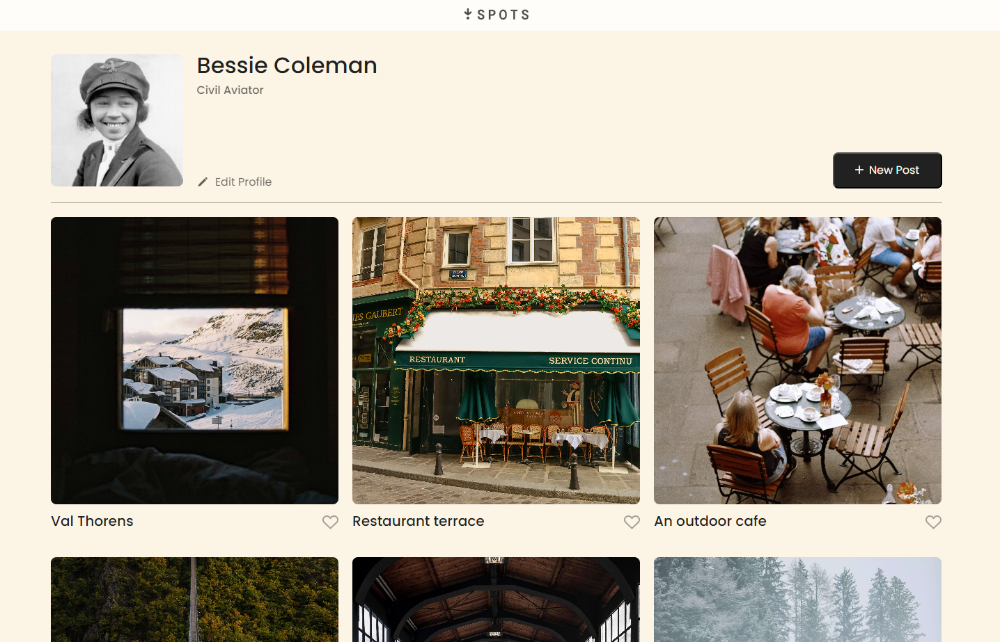

# Project 3: Spots

This is a project that is similar to a social media photo sharing platform. There is a user profile with avatar and grid of photographs with a short description.

This is a new project for the TripleTen SE Bootcamp in the test phase. Completion of this project was to test the instructions, design and provide feedback.

## Project Features

- Flexbox
- Grid
- Hover ELements
- Responsive Design
- BEM

## Deployed Github Page

[https://kehrenclou.github.io/se_project_spots](https://kehrenclou.github.io/se_project_spots)

## Figma

Here is a [link to the project design on Figma](https://www.figma.com/file/BBNm2bC3lj8QQMHlnqRsga/Sprint-3-Project%3A-Spots?type=design&node-id=0-1&mode=design&t=JiWpEtqxwfvfB7ba-0).

## Plan on improving the project

- Working buttons
- Add a User sign in flow
- ability to add and delete Photos

 

